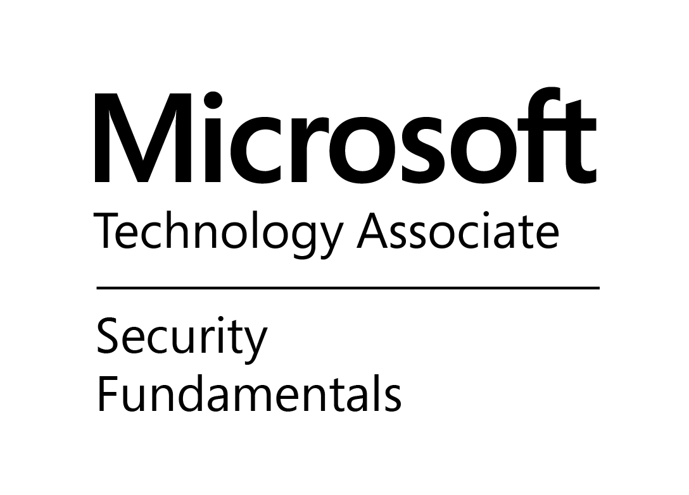

# RJ Hollberg

14294 Pepper Grass Lane  
Herriman, UT 84096  
801-558-3812  
rj.hollberg@outlook.com  
https://taffareljr.github.io/resume

## Table of Contents

- [RJ Hollberg](#rj-hollberg)
  - [Table of Contents](#table-of-contents)
  - [Summary](#summary)
  - [Education](#education)
  - [Certifications](#certifications)
  - [Skills](#skills)
  - [Professional Experience](#professional-experience)
    - [**6. Software Architect** - Willis Towers Watson](#6-software-architect---willis-towers-watson)
    - [**5. Senior Software Developer** - Willis Towers Watson](#5-senior-software-developer---willis-towers-watson)
    - [**4. Senior Software Developer** - Aviacode](#4-senior-software-developer---aviacode)
    - [**3. Software Developer** - Centershift](#3-software-developer---centershift)
    - [**2. Consultant** - Keane, Inc.](#2-consultant---keane-inc)
    - [**1. Technical Research Assistant** - PEGUS Research](#1-technical-research-assistant---pegus-research)

## Summary

- Software architect with 20+ years of experience
- Skilled in server-side architecture, with a particular focus on clean code, extensibility, performance, & scalability
- Specialization in Microsoft .NET technologies, since their inception
- Experienced in virtually all areas of the SDLC: R&D, agile, development, infrastructure, CI/CD, etc.
- Detail-oriented and highly motivated, with a passion for software and technology

## Education

B.S. in Information Technology - Software Emphasis  
_Western Governors University, 2016_

## Certifications

## Skills

- Architecture: CQRS / event-driven / serverless / asynchronous is my primary focus
- Very proficient in the Microsoft stack, including tools, servers, and Azure
- Self-study is my hobby
- Fluent in Portuguese

## Professional Experience

### **6. Software Architect** - Willis Towers Watson

&nbsp;&nbsp;&nbsp;&nbsp;&nbsp;_(2/2017 - Current)_

- Worked with several dev teams, with a specific focus on:
  - Helping teams redesign legacy code as event-based microservices
  - Using refactoring to arrive at those designs (instead of full-scale rewrites)
  - Assisting teams as they migrated to new CI/CD tooling
  - Coordinating integration between teams & their microservices
  - Recommending best practices, patterns, and strategies
  - Assisting developers to grow their personal software skills and plan for their careers (mentoring)
- Used Terraform to build out IaC environments in Azure
- Built several NuGet packages to be shared across microservices, addressing cross-cutting concerns

### **5. Senior Software Developer** - Willis Towers Watson

&nbsp;&nbsp;&nbsp;&nbsp;&nbsp;_(3/2016 - 2/2017)_

- Played a central role in designing and implementing strategy for migrating to new database technology
  - Created efficient tooling to perform automated document migration and verification
- General bugfixes, improving the performance of various components across our system
  - Improved the performance of our largest query by 50-80%
- Explored options for moving our legacy monolith code to microservices

### **4. Senior Software Developer** - Aviacode

&nbsp;&nbsp;&nbsp;&nbsp;&nbsp;_(8/2013 - 2/2016)_

- Helped design and build new SaaS platform for medical coding professionals (built from the ground up using latest technologies and patterns)
  - Server-side distributed system
  - Onion architecture
  - Durable messaging
  - Document storage
  - Client-side SPA
- Specific focus on back-end processes and authentication

### **3. Software Developer** - Centershift

&nbsp;&nbsp;&nbsp;&nbsp;&nbsp;_(2/2005 - 7/2013)_

- Sole R&D role for the company - researched and spearheaded several initiatives to improve our software and SDLC
  - Agile project management
  - Centralized source control & branching strategies (Team Foundation Server)
  - Patterns & practices: SOLID, OOP, DDD, SOA, Clean Code, Code Contracts
  - Development techniques: craftsmanship, refactoring, pair programming
  - Testing techniques: TDD, test pyramid, automation, mocks
  - Virtual dynamic test lab
  - Automated CI builds
  - Automated CD and log aggregation
- Architect and lead developer on vNext SaaS platform
  - Built and maintained critical components for other developers, including:
    - CI/CD pipeline
    - Automated test environment
    - Project architecture
    - Authentication
    - Data access
    - Security
    - Credit card processing
  - Much more robust than anything the company had built before
  - Single codebase, built & optimized for multiple target platforms
  - 10,000+ unit & integration tests run against each target platform, all in <5 mins
  - Maintained >=90% code coverage
- Lead developer for current SaaS platform. Significant contributions include:
  - Data access
  - Core object model
  - Common WinForms controls
  - Web services layer
  - Deployment and Windows installer
- Helped maintain legacy SaaS platform (2005 only)
  - VB6, ADO, ASP, ActiveX, Oracle
- Provided general support for the rest of the development team. When others needed help, I was the one they came to.

### **2. Consultant** - Keane, Inc.

&nbsp;&nbsp;&nbsp;&nbsp;&nbsp;_(7/2001 - 1/2005)_

- Designed, built, and maintained several applications and databases for The Church of Jesus Christ of Latter-Day Saints, including:
  - Global missionary debit card stipend system
  - Genealogical & other historical records manager
  - Tracking system for welfare given to homeless people in SLC
  - Integration of financial data with various 3rd-party systems
- Helped maintain and enhance several legacy applications, including:
  - Global missionary onboarding system
  - Custom project management application
  - Parking permit & ticket management (on handheld devices) for church properties
- Provided general IT support and consulting services

### **1. Technical Research Assistant** - PEGUS Research

&nbsp;&nbsp;&nbsp;&nbsp;&nbsp;_(7/1999 - 7/2001)_

- Designed, built, and maintained several applications and databases, including:
  - Pharmaceutical research studies for companies such as Novartis and GlaxoSmithKlien
  - Internal time tracking and payroll
  - Nationwide network of partner pharmacies
- Provided IT support throughout the company

