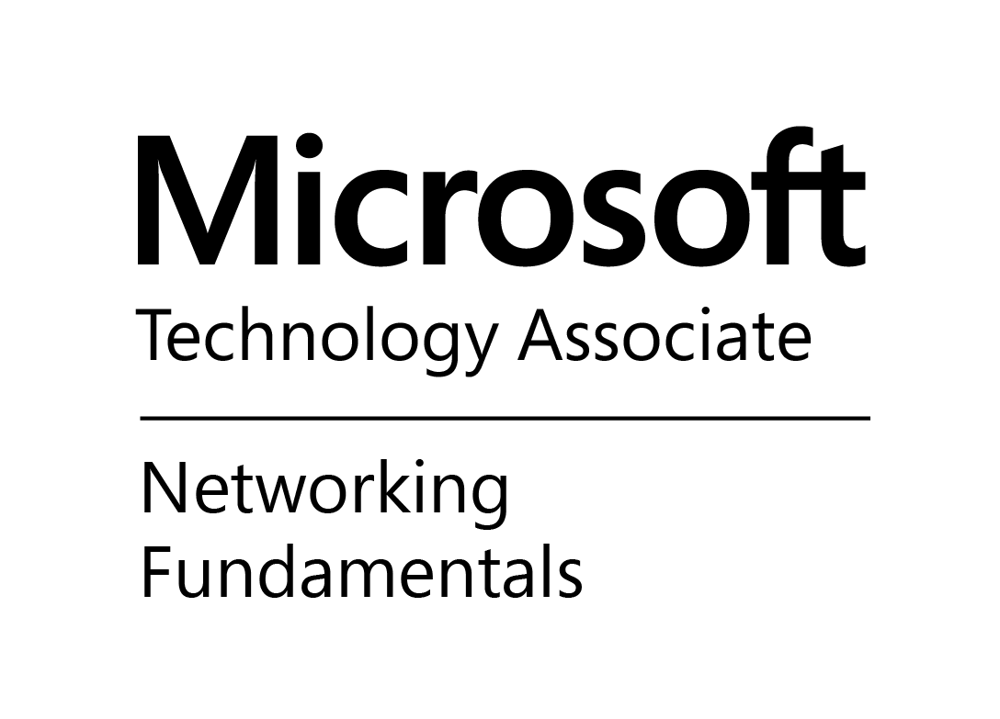
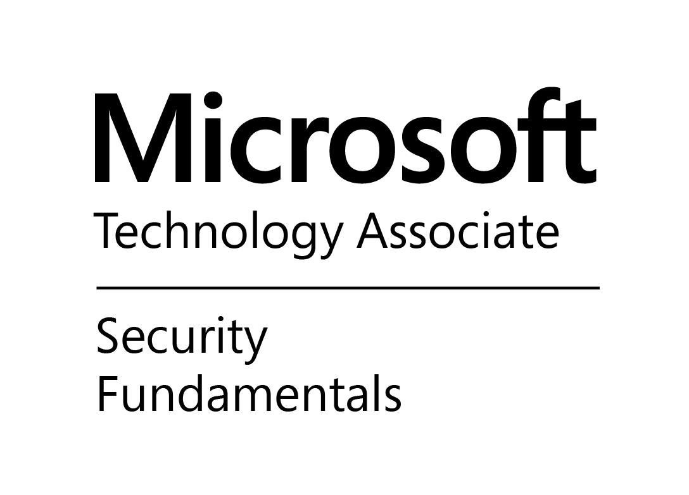

# RJ Hollberg <!-- omit in toc -->

14294 Pepper Grass Lane  
Herriman, UT 84096  
801-558-3812  
[rj.hollberg@outlook.com](mailto:rj.hollberg@outlook.com)  
[taffareljr.github.io/resume](https://taffareljr.github.io/resume)

#### Table of Contents <!-- omit in toc -->

- [Summary](#summary)
- [Skills](#skills)
- [Education](#education)
- [Professional Experience](#professional-experience)
  - [R1 RCM, Inc.](#r1-rcm-inc)
    - [_(3/2023 - Present)_ Staff Software Engineer](#32023---present-staff-software-engineer)
    - [_(7/2021 - 3/2023)_ Software Architect](#72021---32023-software-architect)
  - [Willis Towers Watson plc](#willis-towers-watson-plc)
    - [_(2/2017 - 7/2021)_ Software Architect](#22017---72021-software-architect)
    - [_(3/2016 - 2/2017)_ Senior Software Developer](#32016---22017-senior-software-developer)
  - [Aviacode, Inc.](#aviacode-inc)
    - [_(8/2013 - 2/2016)_ Senior Software Developer](#82013---22016-senior-software-developer)
  - [Centershift, Inc.](#centershift-inc)
    - [_(2/2005 - 7/2013)_ Software Developer](#22005---72013-software-developer)
  - [Keane, Inc.](#keane-inc)
    - [_(7/2001 - 1/2005)_ Consultant](#72001---12005-consultant)
  - [PEGUS Research, Inc.](#pegus-research-inc)
    - [_(7/1999 - 7/2001)_ Technical Research Assistant](#71999---72001-technical-research-assistant)
- [Past Certifications](#past-certifications)

## Summary

Software Architect and technical leader with **25+ years** of hands-on experience
designing and delivering products, including enterprise-scale distributed systems.
Currently leading AI initiatives,
including architecting a production ChatGPT clone
and enabling natural language interfaces over an enterprise data warehouse.

- **Architecture Focus:**
  DDD, event-driven microservices, and clean code principles
- **Microsoft Stack Expert:**
  Deep expertise in .NET ecosystem since 1.0, Azure, and cloud-native development
- **Full SDLC Experience:**
  R&D, agile, development, testing, CI/CD, infrastructure, and DevOps
- **Force Multiplier:**
  Passionate about mentoring developers, establishing best practices,
  elevating team capabilities, and producing high-quality output

## Skills

| Domain                | Technologies & Expertise                                                               |
| --------------------- | -------------------------------------------------------------------------------------- |
| **Architecture**      | DDD, Bounded Contexts, Event-Driven, Microservices, CQRS, Clean/Explicit Architecture  |
| **AI & ML**           | LLMs, RAG, Semantic Kernel, Prompt Engineering, AI Agents, Vector Search, Azure OpenAI |
| **Languages**         | C#, SQL, some web                                                                      |
| **Cloud & Infra**     | Azure (CosmosDB, Event Hubs, Service Bus, App Services), Terraform, Docker, CI/CD      |
| **Data**              | SQL Server, CosmosDB, MongoDB, PostgreSQL, Snowflake, Event Sourcing                   |
| **Practices**         | TDD, Refactoring, Code Review, Pair Programming, Technical Mentorship                  |
| **Languages (Human)** | English (native), Portuguese (quasi-fluent)                                            |

## Education

B.S. in Information Technology - Software Emphasis  
_Western Governors University, 2016_

## Professional Experience

### R1 RCM, Inc.

#### _(3/2023 - Present)_ Staff Software Engineer

- Position name change—the company decided to rename all Architect positions company-wide
  and embed us on specific teams
- Tech lead for the company's first AI app: an internal ChatGPT clone
  - Rapid training on bleeding-edge AI technologies
  - Kept the app up-to-date constantly as AI technology evolved and new features
    were requested, iterating through increasingly complex architectures
  - Roughly on-par with ChatGPT functionality  
    
    
    
    
    
    
    
    
    
    
    
    
    
    
    
    
    
    
    
    
    
    
    
    
    
    
    
    
    
    
    
- Recently joined a BI team where I'm applying my recent AI expertise
  - Moving to allow users to chat with AI over our entire Data Warehouse
  - Customizing AI Agents and various prompt instructions for vibe coding
  - Planning major migration between Azure tenants  
    
    
    
    
    
    
    
    
    
    
    
    
    
    
    
    
    
    
    
    
    
    
    
    

#### _(7/2021 - 3/2023)_ Software Architect

- Worked with Accounts Receivable teams to design a migration of our
  legacy, monolithic apps towards a newer architecture consisting of:
  - Microservices
  - Domain-Driven Design (esp. Bounded Contexts)
  - Event-Driven architecture (between microservices)
  - Explicit Architecture (inside microservices)
- Presented on various technologies and architectural concepts
  for coworkers, other Architects, and management
- Conducted the pilot for GitHub Enterprise
  - Managed all configuration
  - Built and maintained custom build agents
  - Onboarded the entire development staff (and management)
  - Designed and executed the transition strategy from Jira
  - Trained new dedicated GitHub team, then handed off to them
- Built and maintained several packages shared across microservices,
  addressing cross-cutting concerns  
  
  
  
  
  
  
  
  
  
  
  
  
  
  
  
  
  
  
  
  

### Willis Towers Watson plc

#### _(2/2017 - 7/2021)_ Software Architect

- Promotion—worked with several dev teams as a force-multiplier,
  with a specific focus on:
  - Helping teams redesign legacy code as event-based microservices
  - Using refactoring to arrive at those designs (instead of full-scale rewrites)
  - Assisting teams as they migrated to new CI/CD tooling
  - Coordinating integration between teams & their microservices
  - Recommending best practices, patterns, and strategies
  - Assisting developers to grow their personal software skills
    and plan for their careers (mentoring)
- Built out IaC environments in Azure
- Built and maintained several packages shared across microservices,
  addressing cross-cutting concerns  
  
  
  
  
  
  
  
  
  
  
  
  
  
  
  
  
  
  
  
  
  
  
  
  
  
  
  
  
  

#### _(3/2016 - 2/2017)_ Senior Software Developer

- Played a central role in designing and implementing the strategy
  for migrating to new database technology
  - Created efficient tooling to perform automated document migration and validation
- General bugfixes, improving the performance of various components across our system
  - Improved the performance of our largest query by 50-80%
- Explored options for moving our legacy monolith code to microservices  
  
  
  
  
  
  
  
  
  
  
  
  

### Aviacode, Inc.

#### _(8/2013 - 2/2016)_ Senior Software Developer

- Helped design and build new SaaS platform for medical coding professionals, including:
  - Server-side distributed system
  - Onion architecture
  - Durable messaging
  - Document storage
  - Client-side SPA
- Specific focus on back-end processes and security
- Got to work under some truly amazing architects.
  While I wasn't the one driving this time around, I learned a lot.  
  
  
  
  
  
  
  
  
  
  
  
  
  
  
  
  
  
  
  
  
  
  
  
  
  
  

<!-- print-cutoff -->

### Centershift, Inc.

#### _(2/2005 - 7/2013)_ Software Developer

- While the company used the same title for all developers,
  I served in the sole R&D/architect position.
- Researched and spearheaded several initiatives to improve our software and SDLC, including:
  - Project management  
    
    
    - Led a 2-day conference to train the entire company
    - Helped train other companies with a coworker as a side gig
  - Centralized source control  
    
    
    
    
    - Automated CI/CD and log aggregation
    - Virtual dynamic test lab
    - Branching strategies
  - Patterns & practices  
    
    
    
    
    
    
  - Development techniques  
    
    
    
  - Testing techniques  
    
    
    
    
- Architect and lead developer on _vNext_ SaaS platform
  - Built and maintained core components for other developers, including:
    - CI/CD pipeline
    - Automated test environment
    - Project architecture
    - Authentication
    - Data access
    - Security
    - Credit card processing
  - Platform was much more robust than anything the company had built before
  - Single codebase, built & optimized for multiple target platforms
  - 10,000+ unit & integration tests ran against each target platform, all in <5 mins
  - Maintained >=90% code coverage  
    
    
    
    
    
    
    
    
    
    
    
    
    
    
    
    
    
    
    
    
    
    
    
    
    
    
    
    
    
    
    
    
    
    
- Inherited lead development role for _current_ SaaS platform.
  Significant contributions include:
  - Data access
  - Core object model
  - Common UI controls
  - Web services layer
  - Deployment and Windows installer  
    
    
    
    
    
    
    
    
    
    
- Helped maintain _legacy_ SaaS platform
  - During 2005 only  
    
    
    
    
    
    
    
- Provided general support for the rest of the development team.
  When anyone needed help, I was the one they came to.

### Keane, Inc.

#### _(7/2001 - 1/2005)_ Consultant

- Contracted to The Church of Jesus Christ of Latter-day Saints
- Designed, built, and/or maintained several applications and databases, including:
  - Global missionary debit card stipend system
  - Genealogical (and other historical) records manager
  - Tracking system for welfare provided to homeless people in Salt Lake City
  - Integration of financial data with various 3rd-party systems  
    
    
    
    
    
    
    
    
    
    
    
    
    
    
    
    
    
- Helped maintain and enhance several legacy applications, including:
  - Global missionary onboarding system
  - Custom project management application
  - Parking permit & ticket management (on handheld devices) for church properties  
    
    
    
    
    
    
    
    
    
    
- Provided general IT support and consulting services

### PEGUS Research, Inc.

#### _(7/1999 - 7/2001)_ Technical Research Assistant

- Designed, built, and/or maintained several applications and databases, including:
  - Pharmaceutical research studies for companies such as Novartis and GlaxoSmithKline
  - Internal time tracking and payroll
  - Nationwide network of partner pharmacies  
    
    
    
    
    
    
- Provided IT support throughout the company

## Past Certifications

I've earned various certifications over the years—these are no longer active,
but demonstrate breadth of foundational knowledge.
Always happy to pursue new ones if needed.

---

---

---

---

---

---

